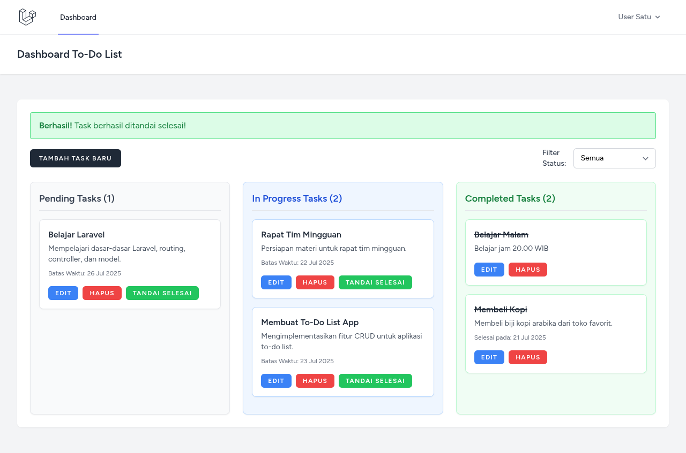

### 📄 Contoh `README.md`


# ✅ Laravel To-Do List App

Sebuah aplikasi **To-Do List** sederhana yang dibangun menggunakan **Laravel**, **Blade Template**, dan **TailwindCSS**. Cocok untuk belajar dasar-dasar Laravel MVC, manajemen tugas, dan layout responsif modern.




## ✨ Fitur Utama

- 🔐 **Autentikasi**
  - Login, Register, Logout (bawaan Laravel Breeze)
- 📝 **Manajemen Tugas (CRUD)**
  - Tambah tugas
  - Tandai sebagai selesai/belum selesai
  - Edit & Hapus tugas
- 📊 **Dashboard Tugas**
  - Tugas aktif & selesai
  - Progress bar & filter tampilan
- 🎨 **Desain Modern**
  - Menggunakan TailwindCSS dan Font Awesome
  - Responsive untuk mobile dan desktop

---

## 🚀 Instalasi

### 1. Clone Repository
```bash
git clone https://github.com/Cs-Blu3Eye/Todo-List.git
cd Todo-List
````

### 2. Install Dependencies

```bash
composer install
npm install && npm run dev
```

### 3. Setup Environment

```bash
cp .env.example .env
php artisan key:generate
```

### 4. Konfigurasi Database

Edit `.env`:

```
DB_DATABASE=todolist
DB_USERNAME=root
DB_PASSWORD=yourpassword
```

### 5. Migrasi & Seeding

```bash
php artisan migrate --seed
```

### 6. Jalankan Server

```bash
php artisan serve
```

Akses: [http://localhost:8000](http://localhost:8000)

---

## 📁 Struktur Folder Penting

```
resources/views/        # Blade templates
resources/css/          # Tailwind input
app/Http/Controllers/   # Controller logic
routes/web.php          # Routing utama
```

---

## 🛠️ Tech Stack

* **Laravel 12**
* **TailwindCSS 3.x**
* **Blade Template**
* **Font Awesome 6**
* **MySQL 8+**

---

## 🧪 Fitur Tambahan Opsional

* Filter tugas by status (semua / aktif / selesai)
* Notifikasi flash message
* Middleware untuk halaman user login

---

## 📸 Screenshots

| Tampilan                     | Deskripsi                           |
| ---------------------------- | ----------------------------------- |
|  | Dashboard tugas dengan UI responsif |

---

## 🧑‍💻 Kontribusi

Pull request dipersilakan! Silakan fork repo ini dan tambahkan ide baru.

---

## 📃 Lisensi

Aplikasi ini open-source dengan lisensi [MIT](LICENSE).

